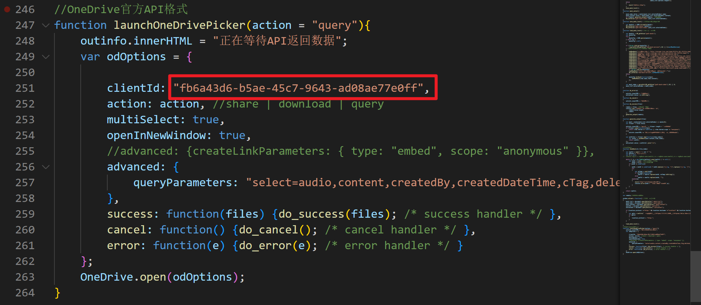
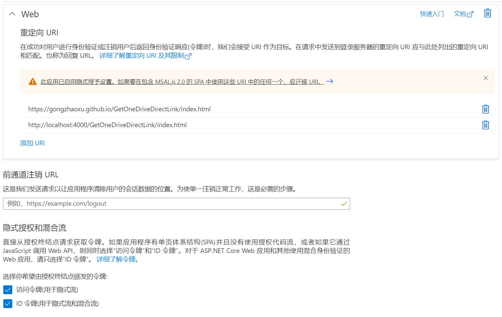
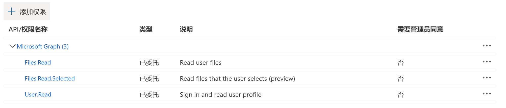

获取OneDrive直链
================

本应用的目的是为了**批量**获取 OneDrive 直链，方便在其他站点外链。

# 作用
对于搭建博客网站的个人来说，要想写出丰富的文章，必然会嵌入很多多媒体文件，此项目便基于微软的OneDrive，只需两步，即可给您的本地文件（如JPEG、PNG、MP4、MP3等）赋予互联网地址：

1.注册OneDrive，上传您所需要在文章中嵌入的图片、视频、音频。

2.使用此项目，解析出直链。
# 优点
1.免费，OneDrive有5g免费存储空间，可按需扩容，对于长期使用的个人用户来说非常的划算。您不必在各大云厂商购买昂贵的存储服务，

2.解析速度快，采用OneDrive官方接口，可大批量解析直链。

3.资源直接加载，不必下载后浏览。
2.使用此项目，解析出直链。
# 马上使用

[https://gongzhaoxu.github.io/GetOneDriveDirectLink/index.html](https://gongzhaoxu.github.io/GetOneDriveDirectLink/index.html)

> 因为使用官方 API 直接访问 onedrive.live.com 选择文件，因此可能需要翻墙。

# 隐私声明

使用微软官方 [OneDrive file picker SDK](https://docs.microsoft.com/onedrive/developer/controls/file-pickers/js-v72/)，本应用不会得到你的账号密码和其他用户资料。
目前仅申请了 `Files.Read`、`Files.Read.Selected` 两个权限，SDK 只会返回用户选择的文件的信息，不会获得未授权的其他内容。

# 如何自行搭建

> 按照[OneDrive file picker SDK](https://docs.microsoft.com/onedrive/developer/controls/file-pickers/js-v72/)内的说明进行，由于旧有的*Microsoft 应用注册门户*已经迁移到*Azure门户*，特此做出更新，此版本更新于2022年11月7日。

1. 应用注册在 [Azure 门户](https://portal.azure.com/#blade/Microsoft_AAD_RegisteredApps/ApplicationsListBlade) 创建应用，自己申请一个应用 ID，然后替换本程序 `script.js` 内底部的 `clientId`。其中 `odOptions.advanced.queryParameters` 内容参见 [DriveItem 资源类型](https://docs.microsoft.com/onedrive/developer/rest-api/resources/driveitem?view=odsp-graph-online)，若不设定，将只返回基本信息。
2. 设置**身份验证**将网页的各种东西上传到你申请 ID 时设置的 重定向 URL 即可，页面 URL 不在重定向内会发生错误。注：这个页面必须为 https（仅 localhost 可为 http，且 localhost 也需添加到 重定向 URL）需要勾选**隐式授权**的**访问令牌**、**ID 令牌**。
   
3. 设置**API 权限**
   添加 `Microsoft Graph` ▶ `委托的权限` ▶ `Files.Read`、`Files.Read.Selected`
   

## 原理

`http://storage.live.com/items/文件ID` 是很早之前就流传的 SkyDrive 官方的真实直链重定向地址，出处不可考。
开始一般是用 `http://storage.live.com/items/文件ID?filename=xxx.jpg`来外链图片，后来有高手发现的 `http://storage.live.com/items/文件ID:/xxx.jpg`这个地址格式不会影响 SkyDrive 识别ID，还同时可以欺骗浏览器为普通文件地址，识别出文件的文件名与扩展名。
访问 `onedrive.live.com` 域名需要翻墙，但是生成的 `storage.live.com` 链接不需要。
